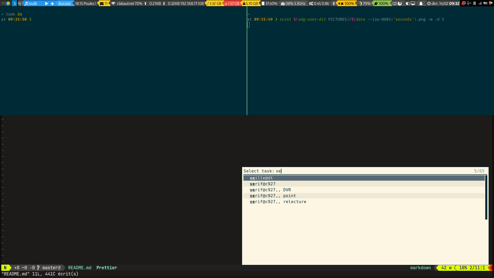

[](https://liberapay.com/matclab/donate)

# Rofi for Hamster Time Tracker
Simple script using [rofi](https://github.com/davatorium/rofi) to change
current activity, with a companion script to display the current activity in
i3 bar ([i3status-rust](https://github.com/greshake/i3status-rust) for the
moment).



## Features
- Stop the current activity by selecting it (selected by default)
- Choose an activity among the list of previous activities (sorted by
  frequency and recency)
- Start a new activity by typing in the rofi input field
- Edit a past activity before starting it with `Ctrl + space`
- Add a start time by editing the activity and appending a time or a delay in
  minute (`10:10` or `-25`)

## Requirements
- [hamster time tracker](https://github.com/projecthamster/hamster)
- [rofi](https://github.com/davatorium/rofi)
- [xsv](https://github.com/BurntSushi/xsv) a fast CSV CLI toolkit
- [frece](https://github.com/YodaEmbedding/frece) tool to maintain a database
    sorted by frecency
- [dunst](https://dunst-project.org/) notification manager (could be replaced
    by any notification manager)

## Usage
Simply launch the script `rofi-hamster`.

## Integration with `i3status-rust` bar
If you use [i3status-rust](https://github.com/greshake/i3status-rust), you may
add a widget showing the current activity with the following config to your
`i3status-rs.toml`:
```toml
[[block]]
block = "custom_dbus"
name = "CurrentHamsterActivity"
```
And starting the monitoring script in your i3 `config`:
```
exec --no-startup-id sh -c "while true; do ~/.config/rofi/scripts/rofi-hamster/hamster-monitor.sh; done"
```

Note that the monitoring script use `qdbus` (from `qt5-tools` package on Arch
linux).
